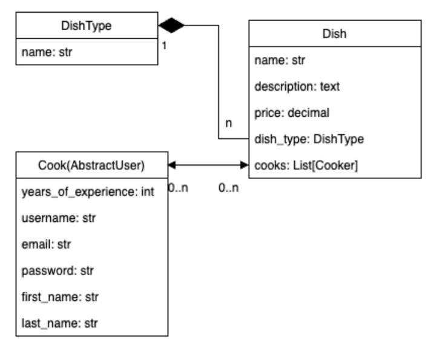
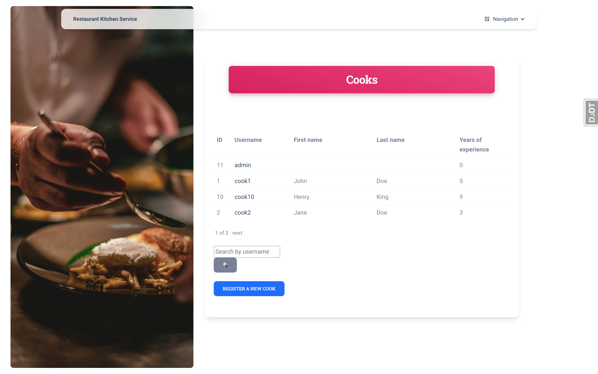
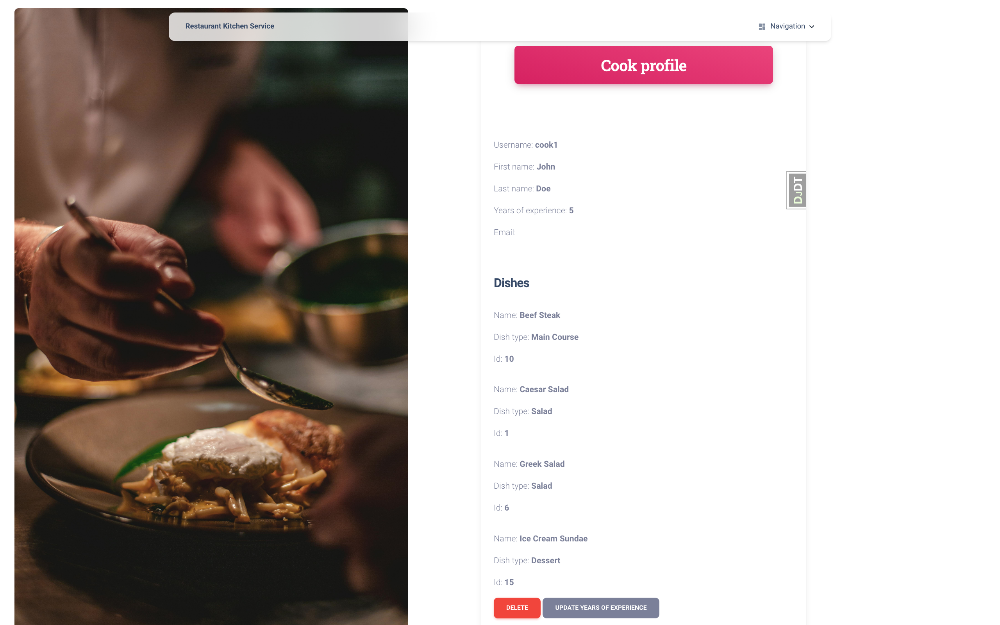
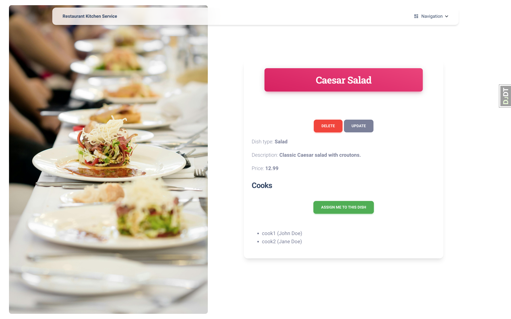

# Restaurant kitchen service

### This is a site that implements a kitchen management service for restaurants.

<br>

## Access to service

## `Product page`
- click 👉 [Restaurant kitchen service](https://restaurant-kitchen-service-t3fr.onrender.com)

- copy 👉 https://restaurant-kitchen-service-t3fr.onrender.com

### Test user
### `username:` `test_user`

### `password:` `Y.+K[FdVJ%1%1Je`

## Installing / Getting started

### Python3 must be already installed


```shell
git clone https://github.com/TarasFirst/restaurant-kitchen-service.git
cd restaurant-kitchen-service
python3 -m venv venv
venv\Scripts\activate (on Windows)
source venv/bin/activate (on macOS)
pip install -r requirements.txt
```

## Set Up Database

```shell
python manage.py makemigrations
python manage.py migrate
```

## At this point the app runs at `http://127.0.0.1:8000/`. 

```shell
python manage.py runserver
```

## Features
* Access only to authorized users
* Create cooks, dish types and dishes, update them and remove.
* Dishes and cooks can be linked together.
* And some other features.


## Demo

### Structure database


### Some pages





